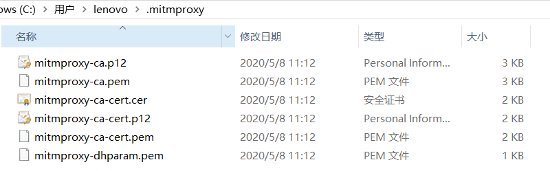
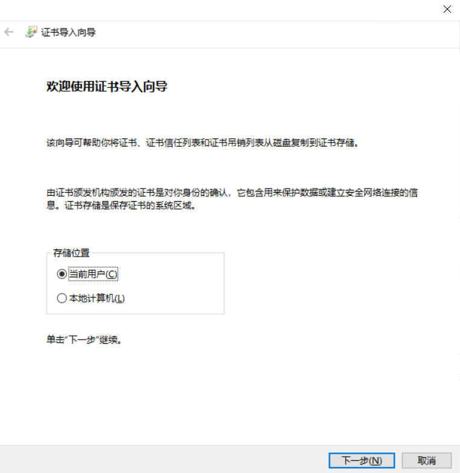
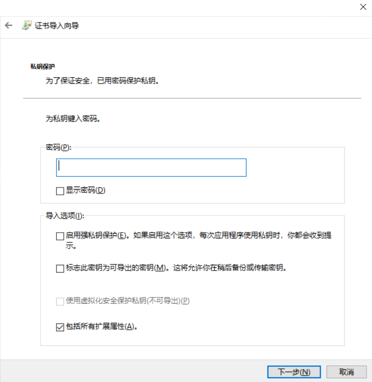
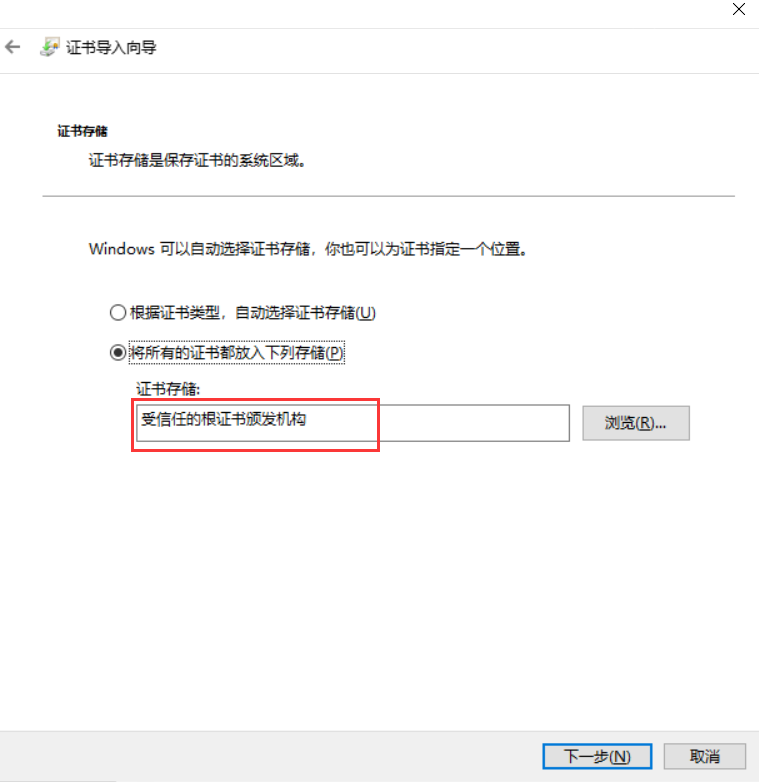
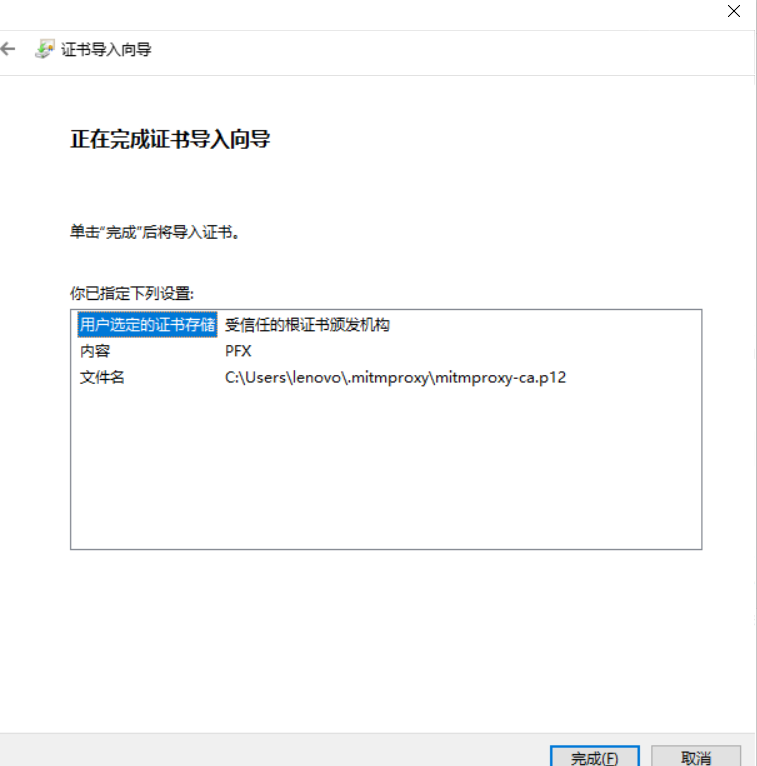
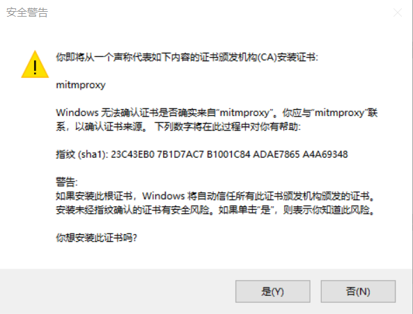

# mitmproxy 的安装和使用

## mitmproxy 介绍 

mitmproxy 就是用于 MITM 的 proxy，MITM 即中间人攻击（Man-in-the-middle attack）。用于中间人攻击的代理首先会向正常的代理一样转发请求，保障服务端与客户端的通信，其次，会适时的查、记录其截获的数据，或篡改数据，引发服务端或客户端特定的行为。

mitmproxy 是一个支持HTTP和HTTPS的抓包程序，类似Fiddler、Charles的功能，只不过它通过控制台的形式操作。

此外，mitmproxy 还有两个关联组件，一个是 mitmdump，它是 mitmproxy 的命令行接口，利用它可以对接Python脚本，实现监听后的处理；另一个是mitmweb，它是一个Web程序，通过它以清楚地观察到 mitmproxy 捕获的请求。

## mitmproxy 相关链接：

*   GitHub：https://github.com/mitmproxy/mitmproxy

*   官方网站：https://mitmproxy.org

*   使用方法：https://juejin.im/post/5ac9ea6d518825364001b5b9#heading-1

*   使用方法：https://www.cnblogs.com/H4ck3R-XiX/p/12624072.html

## mitmproxy 安装：

`windows` 安装链接：https://github.com/mitmproxy/mitmproxy/releases/

1、选择相应的安装包运行安装

2、在相应目录下启动 mitmdump，可以生成CA证书：

*   对于mitmproxy来说，如果想要截获HTTPS请求，就需要设置证书：

        mitmdump

*   接下来，我们就可以在用户目录下的.mitmproxy目录里面找到CA证书：

        C:\Users\lenovo\.mitmproxy

    

    

        mitmproxy-ca.pem:          PEM格式的证书私钥

        mitmproxy-ca-cert.pem:     PEM格式证书，适用于大多数非Windows平台

        mitmproxy-ca-cert.p12:     PKCS12格式的证书，适用于Windows平台

        mitmproxy-ca-cert.cer:     与mitmproxy-ca-cert.pem相同，只是改变了后缀，适用于部分Android平台

        mitmproxy-dhparam.pem:     PEM格式的秘钥文件，用于增强SSL安全性

3、安装证书

*   双击 `mitmproxy-ca.p12`，就会出现导入证书的引导页

    

    

    直接下一步，到输入密码步骤

    

   
    无需输入密码，直接下一步

    

   
    选择证书存储

    

    
    完成
    

    
    是

